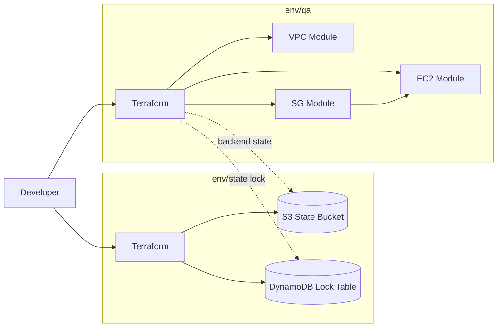

# Terraform Project

Terraform-based AWS infrastructure project using reusable modules and environment-specific root configurations.

## Diagram



## Project Overview

This repository provisions:

- Virtual Private Cloud (VPC) networking
- HTTP-enabled Security Group
- EC2 compute instance
- Remote Terraform backend foundation (S3 state bucket + DynamoDB lock table)

## Repository Structure

```text
Terraform_Project/
├── env/
│   ├── bootstrap/
│   │   ├── main.tf
│   │   ├── output.tf
│   │   ├── provider.tf
│   │   ├── variables.tf
│   │   ├── versions.tf
│   │   └── terraform.tfvars
│   └── qa/
│       ├── main.tf
│       ├── outputs.tf
│       ├── provider.tf
│       ├── variable.tf
│       ├── versions.tf
│       └── terraform.tfvars
├── modules/
│   ├── ec2/
│   │   ├── main.tf
│   │   └── outputs.tf
│   ├── sg/
│   │   ├── main.tf
│   │   └── outputs.tf
│   └── vpc/
│       ├── main.tf
│       └── outputs.tf
└── README.md
```

## Module Summary

- `modules/vpc`: Provisions VPC, public/private subnets, and networking options.
- `modules/sg`: Provisions an HTTP-enabled security group in a target VPC.
- `modules/ec2`: Provisions an EC2 instance in a specified subnet.

## Environment Model

Each environment under `env/` is a Terraform root module and typically includes:

- `versions.tf` for Terraform/provider version constraints
- `provider.tf` for cloud provider configuration
- `variable.tf` for input variable declarations
- `main.tf` for module composition
- `outputs.tf` for environment outputs
- `terraform.tfvars` for environment values

The current repository includes:

- `env/bootstrap`: Creates shared backend resources (S3 state bucket with versioning and DynamoDB lock table).
- `env/qa`: Provisions workload infrastructure (VPC, SG, EC2) and consumes the remote backend.

Additional environments (for example `env/prod`) can follow the same root-module pattern as `env/qa`.

## Prerequisites

- Terraform `>= 1.5.0`
- AWS CLI (v2 recommended)
- Valid AWS credentials/profile configured locally

## Terraform Workflow

Run from the selected environment folder:

```bash
terraform init
terraform fmt
terraform validate
terraform plan
terraform apply
```

For first-time backend setup:

1. Run `terraform init && terraform apply` in `env/bootstrap`.
2. Configure backend in `env/qa` with `backend.tf` and pass backend values at init time.
3. Run in `env/qa`:

```bash
terraform init -migrate-state \
  -backend-config="bucket=<state-bucket-name>" \
  -backend-config="region=<aws-region>" \
  -backend-config="dynamodb_table=<lock-table-name>" \
  -backend-config="profile=<aws-profile>"
```

## Security and Version Control

- Do not commit secrets or credential material.
- Keep state and local Terraform artifacts out of source control.
- `*.tfvars`, `*.tfstate*`, `.terraform/`, and `.terraform.lock.hcl` are ignored by `.gitignore` in this repository.

## Troubleshooting

- **No Terraform configuration files**
  - Run Terraform from an environment root folder (for example, `env/qa`) or use `-chdir`.

- **InvalidClientTokenId / ExpiredToken**
  - Refresh AWS credentials for the active profile, then rerun `terraform plan`.
